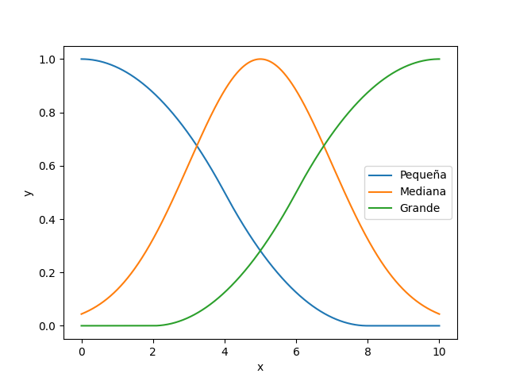
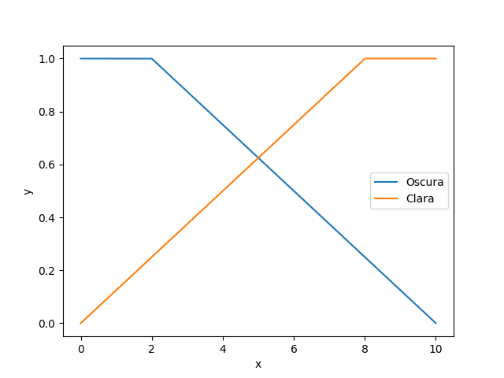
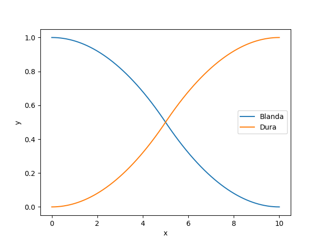
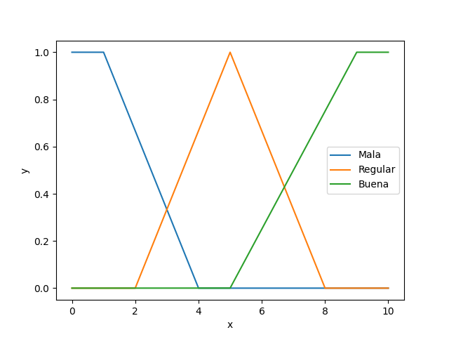

# Proyecto de Simulación. Lógica e inferencia difusa

Autor: Tony Raul Blanco Fernández - C411

## 1. Propuesta del problema

El siguiente problema no es real, los datos y variables son tomados por la noción del autor (quien no es experto en el tema) y no de estudios estadísticos. 

En una fabrica de papas fritas, el recibo de materias primas, como la papa, no siempre tiene la calidad acertada para el standard de calidad. Por eso hay cintas transportadoras que son capaces de desviarlas por diferentes canales según el análisis de cada una a partir de varias pruebas rápidas. 

## 2. Sistema de inferencia propuesto

Nuestro modelo contiene las siguientes variables lingüísticas:

- Tamaño de la papa: pequeña, mediana, grande
- Color: oscura, clara
- Suavidad de la masa: blanda, dura
-  Calidad:   mala, regular, buena

A continuación mostraremos las graficas del grado de pertenencia de los valores de nuestras variables

#### Tamaño:

#### Color:

#### Suavidad:

#### Calidad:

### Reglas 

**Variables de entrada**: Tamaño, Color, Suavidad

**Variables de salida**: Calidad

Las reglas que usaremos para este sistema son: 

1. Si el Color es oscuro y la Suavidad es blanda, entonces la Calidad es Mala
2. Si el Tamaño es pequeño, y de Color oscuro, entonces la Calidad es Mala
3. Si el Tamaño es mediano, y la Suavidad es blanda, entonces la Calidad es Mala
4. Si el Tamaño es pequeño y de Suavidad Dura y de Color Blanco, entonces la calidad es Regular
5. Si el Color es claro y el tamaño mediano, entonces la Calidad es Regular
6. Si la Suavidad es dura y el Color es oscuro, entonces la Calidad es Regular
7. Si la Suavidad es dura y el Color es claro, entonces la Calidad es Regular
8. Si el Tamaño[^1]  es grande, el Color oscuro, entonces la Calidad es Regular
9. Si el Tamaño es grande, el Color claro, entonces la Calidad es Buena
10. Si el Tamaño es mediano, la Suavidad dura y el Color claro, entonces la Calidad es Buena

[^1]: El tamaño no importa ;)  

## 3. Métodos de inferencia y Agregación

Para modelar los problemas nuestra biblioteca posee variadas herramientas. En el archivo functions.py se encuentran modeladas diferentes funciones comúnmente usadas como función de membresía para conjuntos difusos. También nuestras reglas gozan del uso de predicados disjuntos y conjuntos, con operadores de Unión(`|`), Intersección (`&`) o Complemento (`!`).

Los métodos para realizar la defusificacion están insertados de forma implícita en los valores lingüísticos.

En el archivo inference.py se encuentran también dos métodos de inferencia implementados. Mamdani y Larsen. 

Los ejemplos de uso se encuentran en el archivo main.py el cual es usado para la solución de nuestro problema.

## Pruebas

Luego de realizar variadas pruebas, estos fueron los resultados arrojados:

- Prueba 1. Tamaño 3, Color 7, Suavidad 5
  - Mamdani: 5.055
  - Larsen: 5.072
- Prueba 2. Tamaño 4, Color 1, Suavidad 1
  - Mamdani: 3.785
  - Larsen: 5.072
- Prueba 3. Tamaño 5, Color 1, Suavidad 10
  - Mamdani: 4.79
  - Larsen: 4.842
- Prueba 4. Tamaño 4, Color 4, Suavidad 5
  - Mamdani: 5.066
  - Larsen: 50.98

